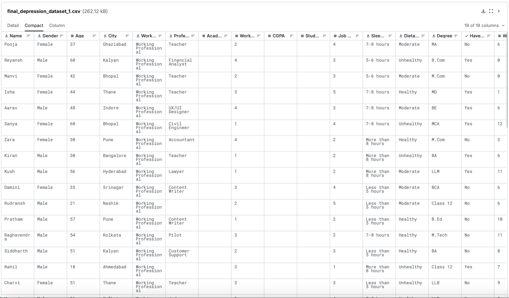

# Relatório inicial 
Algumas considerações iniciais sobre o Dataset que será utilizado para nossa análise
## Dataset depression survey
Você pode acessar o dataset que iremos utilizar [aqui](https://www.kaggle.com/datasets/sumansharmadataworld/depression-surveydataset-for-analysis) 

### Sobre o dataset
O dataset traz dados sobre diversas pessoas, como sua idade, gênero, cidade onde mora e proffisão. Além de notas de satisfação sobre estresse financeiro, satisfação e pressão profissional. 

### Objetivo
Nosso objetivo é fazer a correlação entre esses dados e baseado no resultado, descobrir as causas e os riscos que podem levar alguém a ter depressão. 

